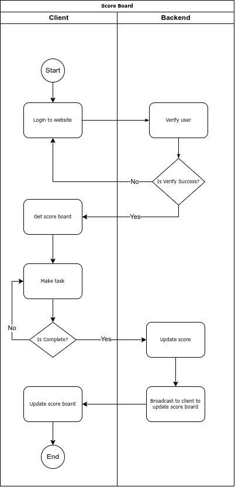

# Scoreboard API Module Specification

## Overview

The Scoreboard API module is a backend service that manages the leaderboard for a website. It ensures live updates to the scoreboard, processes user actions to update scores, and includes security measures to prevent unauthorized score increments.

### Key Features

1. **Top 10 Leaderboard**: Displays the top 10 users with the highest scores.
2. **Live Updates**: Implements live updates to reflect real-time changes on the scoreboard.
3. **Score Update Endpoint**: Provides an API endpoint to update user scores upon completion of actions.
4. **Authorization and Validation**: Ensures only authorized users can update scores.

---

## API Endpoints

### 1. Update Score

**Endpoint**: `/api/v1/scores/update`

**Method**: `POST`

**Description**: Updates the score of a user upon completing a valid action.

**Request Payload**:

```json
{
  "userId": "string",
  "actionId": "string"
}
```

- `userId`: The unique identifier of the user.
- `actionId`: A unique identifier for the action being performed.

**Response**:

- **Success**: 200 OK

```json
{
  "message": "Score updated successfully",
  "newScore": "integer"
}
```

- **Error**: 400 Bad Request / 403 Unauthorized

```json
{
  "error": "string"
}
```

**Validation**:

- Check if the `actionId` is valid and unique to prevent duplicate updates.
- Verify the `userId` and ensure the user is authorized.

---

### 2. Fetch Top 10 Scores

**Endpoint**: `/api/v1/scores/top`

**Method**: `GET`

**Description**: Retrieves the top 10 users with the highest scores.

**Response**:

- **Success**: 200 OK

```json
[
  {
    "userId": "string",
    "score": "integer"
  },
  ... // Up to 10 users
]
```

---

## System Design

### Data Model

1. **User**:

   - `userId`: Unique identifier for the user.
   - `score`: Integer value representing the user’s score.

1. **Action**:

   - `actionId`: Unique identifier for the user.
   - `name`: Integer value representing the user’s score.
   - `score`: Score of the action.

1. **UserAction**:
   - `actionId`: Unique identifier for each action.
   - `userId`: Identifier of the user performing the action.
   - `timestamp`: Time when the action was performed.

### Database Structure

#### Table: `users`

| Column | Type    | Description    |
| ------ | ------- | -------------- |
| userId | String  | Unique user ID |
| score  | Integer | User's score   |

#### Table: `users_actions`

| Column    | Type      | Description        |
| --------- | --------- | ------------------ |
| actionId  | String    | Unique action ID   |
| userId    | String    | Associated user ID |
| timestamp | Timestamp | Action timestamp   |

#### Table: `actions`

| Column   | Type   | Description      |
| -------- | ------ | ---------------- |
| actionId | String | Unique action ID |
| score    | Number | Action's score   |

---

## Implementation Details

### Real-Time Updates

- Use WebSockets or Server-Sent Events (SSE) for live scoreboard updates.
- Clients subscribe to updates from the backend.
- Backend broadcasts changes to all connected clients whenever scores are updated.

### Security

1. **Authentication**: Use JWT tokens for user authentication.
2. **Rate Limiting**: Implement rate limiting on the `/update` endpoint to prevent abuse.
3. **Action Validation**: Verify that the `actionId` corresponds to a legitimate and unique action.

### Error Handling

- Return appropriate HTTP status codes for different errors:
  - 400 for bad requests (e.g., invalid payload).
  - 401 for unauthorized requests.
  - 500 for internal server errors.

---

## Diagram

Below is the execution flow diagram illustrating the update process:

1. User performs an action on the frontend.
2. Action triggers a `POST` request to `/api/v1/scores/update`.
3. Backend validates the request.
4. Score is updated in the database.
5. Backend broadcasts the updated scores to connected clients.

## 

## Additional Comments

1. **Scalability**: Consider implementing a caching layer (e.g., Redis) for frequently accessed data like the top 10 leaderboard.
2. **Database Optimization**: Use database indices on `userId` and `score` for fast lookups.
3. **Testing**: Ensure unit tests and integration tests cover scenarios like concurrent score updates and invalid requests.
4. **Monitoring**: Set up logging and monitoring for the API endpoints to track performance and detect issues.

---
